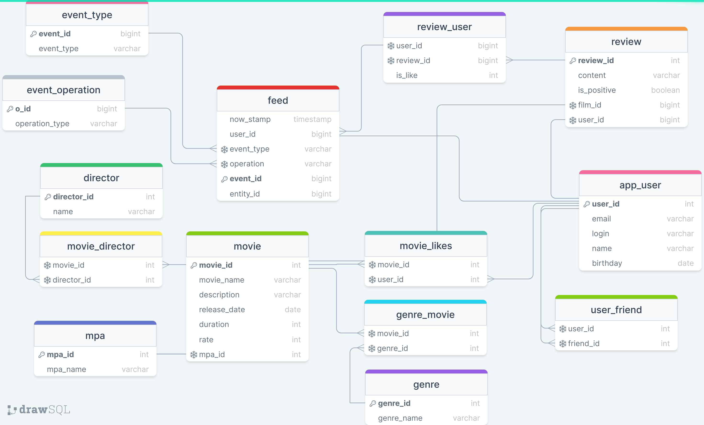

# Filmorate project
Repository for group project.

### Overall description
The Filmorate application is a backend for a service that deals with movies and ratings. 
Users are able to add, update, search and remove movies, make friends, leave reviews and recommend 
movies to each other. 

#### Technologie-Stack:
- Spring Boot, JDBC template, embedded database (H2), SQL, Maven, Git, logging, Lombok, Exceptions.

[Link to diagram in project docs](drawSQL-database.v6.png)

To see the diagram online use this [link](https://drawsql.app/teams/new-13/diagrams/filmorate)

### As the result of group project, the following functionality has been implemented:

- "Reviews" - users can now to leave reviews for movies. Added reviews have 
a rating and additional characteristics: the usefulness and positivity of the review.
- "Feed" - the ability to view the latest events on the platform is now added - adding to friends, removing from 
friends, likes and reviews left by the user's friends.
- "Recommendations" - ability to recommend movies to users with familiar interests is added.
- "Directors" - information about the movie director is added as well as sorting most popular movies by 
given director and year.
- "Remove endpoint" - it is now possible do remove users and movies from the platform.
- "Common films" - implemented output of movies shared with a friend sorted by their popularity.
- "Most popular" - Added the ability to display top-N movies by the number of likes. Filtering is based
on two parameters: by genre and/or for the specified year.
- "Search" - Implemented search by movie title and director. The algorithm can search by substring.