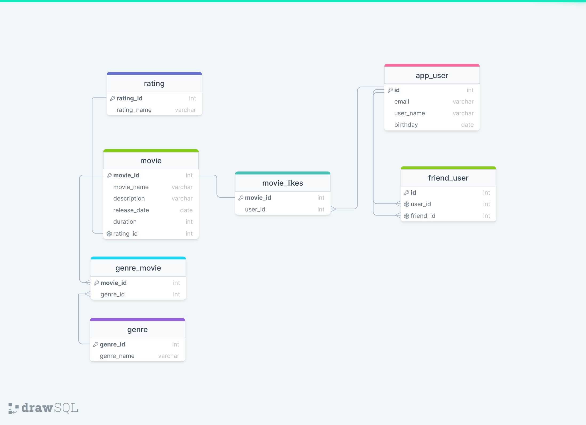

# java-filmorate
Template repository for Filmorate project.

[Link to diagram in project docs](drawSQL-filmorate.v3.png)

To see the diagram online use this [link](https://drawsql.app/teams/new-13/diagrams/filmorate)

#### Пример запроса на получение списка юзеров:
SELECT *  
FROM user

#### Пример запроса на получение юзера по id:
SELECT *  
FROM user AS u  
WHERE u.user_id = id

#### Пример запроса на получение таблицы друзей конкретного юзера (id = 1):
SELECT *  
FROM friend_user AS f  
WHERE f.user_id = id

#### Пример запроса на получение рейтинга фильма по названию:
SELECT m.movie_name,  
        r.rating_name  
FROM movie AS m  
LEFT OUTER JOIN rating AS r ON m.rating_id = r.rating_id

#### Пример запроса на получение списка всех фильмов с рейтингом PG:
SELECT m.movie_name,  
g.genre_name  
FROM movie AS m  
LEFT OUTER JOIN genre_movie AS gm ON m.movie_id = gm.movie_id  
LEFT OUTER JOIN genre AS g ON gm.genre_id = g.genre_id